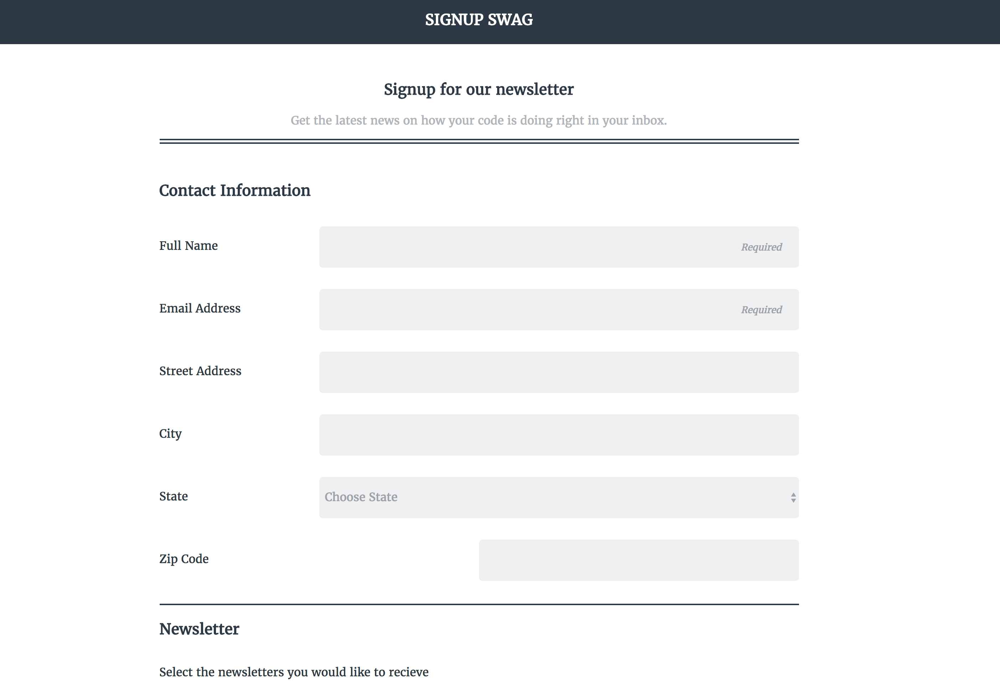

# **Signup Swag**

##### A project built using HTML5 and CSS3 1.9.2016
#
##### By [Sam Peppard](https://github.com/sampeppard)
#

----
### **Description**

A template for a responsive, mobile-first form styled with pseudo-classes

----
### **Setup/Installation Requirements**

* Clone this repository
* If editing, open project directory in Code Editor of choice
* If viewing, open index.html in a web browser

----

### **Known Bugs**

No known bugs.

----
### **Support and contact details**

For comments or questions, please email sampeppard@gmail.com

----
### **Technologies Used**

* HTML
* CSS3

## Link to project on Github Pages

https://sampeppard.github.io/signup_swag/

----
### **License**

MIT
